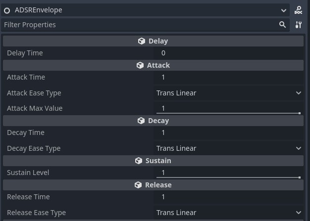

# Godot ASDR envelope

General purpose ADSR envelope for Godot.  



**Info**: this ADSR envelope uses the built-in Godot's tweening library.

# How to install

Just copy the `ADSREnvelope.gd` to your project.  

# Usage

```gdscript
var adsr:ADSREnvelope

#Start the adsr evelope.
adsr.trigger()

#Tells this adsr evelope to hold `adsr.VALUE` while on sustain phase.
adsr.hold()

#Tells this adsr evelope to stop the sustain phase and start the release phase.
adsr.drop()

#The current value of this adsr envelope. Its a float value.
adsr.VALUE

#The current phase of this adsr envelope. (It uses the ADSREnvelope.PHASE enum)
adsr.currentPhase

#Is this adsr trigged now? 
adsr.is_trigged 

#Is this adsr done? (GETTER only)
adsr.is_done

#Is this adsr donw? (Did something called adsr.hold() before?) (GETTER only)
adsr.is_down

#Stop all tweens. VALUE will be 0.0.
adsr.forceStop()
```

```gdscript
#example
func _process(_delta):
	valueLabel.text = str(adsr.VALUE)
	if(Input.is_action_pressed("start_move")):
		adsr.hold()
		if(adsr.is_done):
			adsr.trigger()

	if(Input.is_action_just_released("start_move") and !adsr.is_done):
		adsr.drop()

	if(adsr.current_phase == ADSREnvelope.PHASE.SUSTAIN):
		sprite.rotate(0.1)

	sprite.position = lerp(startPoint, targetPoint.position, adsr.VALUE)
```

# Phases' info

Information about the phases, on the order that they are called.

- **Delay**
	- While on this phase `adsr.VALUE` will be `0.0`
- **Attack**
	- While on this phase `adsr.VALUE` will increase from `0.0` to `Attack Max` using the `Attack Ease Type`
- **Decay**
	- While on this phase `adsr.VALUE` will decrease from `Attack Max` to `Sustain Level` using the `Decay Ease Type`
- **Sustain**
	- While on this phase `adsr.VALUE` will be the same as `Sustain Level`
- **Release**
	- While on this phase `adsr.VALUE` will decrease from `Sustain Level` to `0.0` using the `Release Ease Type`
- **Done**
	- While on this phase `adsr.VALUE` will be `0.0`

# When use this?

ADSR is used a lot in music production and sound synthesis, but it can also be used in games or anything that need a tweening that needs an increase, decrease and a "hold" phase.  
Since this use a normalized value you can use lerp to range to another start/end values.

# "Why not create the tweens by myself?"

You can do that, but if you just need an ADSR envelope you can just use this.

# Future

- Implement as a full `DAHDSR` envelope. 
- This would be great to be a builtin Godot's node.
